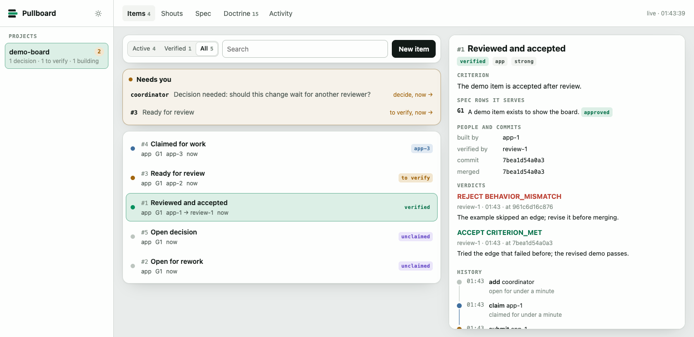
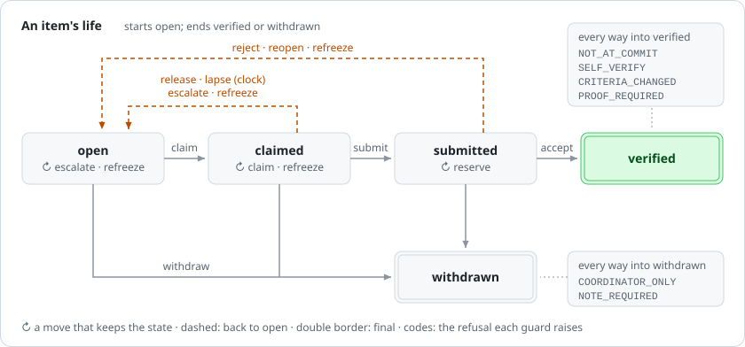

# Pullboard

[](https://github.com/pullboard-dev/pullboard/actions/workflows/gate.yml)

**Vibe code a real product.** Your agents build from a spec you approved, in lanes that keep them out of each other's way, and nothing they build counts until a second agent verifies it.

Pullboard is a work board that lives in your git repo. Every requirement is a one-line row in `SPEC.md`. Agents claim work, build it in their own worktrees, and submit it at a commit with your tests passing. A different agent, from a different model family if you like, checks it against the bar that was frozen when the work started. You decide what to build, answer the questions, and watch it all on one page.

It runs locally: no account, nothing hosted, no dependencies. The board is one SQLite file inside `.git`. It works with Claude Code, Codex and any agent you can run from a shell, and it never calls a model.


## Why

Coding agents are fast, and on day one it feels like magic. Past a demo, the same things go wrong on every project:

- **It said done. It wasn't.** The test got weaker, the commit was never made, or the work skipped the hard case.
- **The agent forgot what you decided.** The plan lived in a chat that ended.
- **A fix broke something that worked.** Nobody ran the tests that would have caught it.
- **Two agents edited the same file.** Running more agents made it worse.

Pullboard gives your agents what a good team has: a shared plan, house rules, their own lanes, and someone who checks the work.

| | |
| --- | --- |
| **A spec they build against** | One row per requirement, with an id and a status. Only rows you approve are the contract; a guess stays a draft and a question waits for you. When an agent claims an item, its criterion and the rows it cites are frozen for that work. Commits cite the rows they serve. |
| **Rigor that runs itself** | Your house rules live in `PRACTICE.md`. Git hooks enforce them on every commit: commit messages cite real spec rows, nothing lands outside an agent's lane, and a deleted requirement is refused. Submit needs a clean tree and your test gate green at that commit. |
| **A team, not one agent** | Each agent works in its own worktree and lane. Claims are atomic, so two agents never take the same item, and an item can wait on another. Cheaper models take the simple items. |
| **Proof before it counts** | The builder can never verify its own work. A different agent checks out a tree that contains the submitted commit and records ACCEPT, with the proof it tried, or REJECT, with a reason. The verdict is bound to the submitted commit, and rejected work must come back changed. `pullboard ledger` prints the receipts. |

## Built with itself

Pullboard is built with Pullboard. On 6 October 2026, one Claude agent made 17 changes to this CLI in 23 submissions. A Codex agent verified each one from its own worktree. It recorded 5 rejections, each with a counterexample anyone could rerun, and caught a sixth problem while that item's bar was being refrozen:

- a suggested `cd` line sent agents to the wrong folder when a path held a `$`;
- the test-log digest lost its summary line when one failure line was very long;
- git settings from the environment leaked into the tour;
- a feature had no test that could fail;
- two messages that tell an agent what to do next were wrong in edge cases.

All six were fixed before they merged. Before accepting each code change, the verifier tried to break it, usually by reverting the fix and watching its test fail. Here is one receipt from that day, with the board's agent ids (the builder, `coordinator`, was the Claude agent; the verifier, `tests-2`, a Codex agent) and the verifier's own words, abridged:

```
#13  worktree prints a subagent's opening lines
     criterion 5349dc84b0ab, frozen at claim             built by coordinator, submitted 12f3640f8630

     REJECT  BEHAVIOR_MISMATCH  by tests-2
             "...the generated prompt cd line double-quoted the token without shell
             escaping it. With PULLBOARD_PATH_PROBE unset, copying the printed cd line
             expanded the token away and exited 1 with no such directory."

     resubmitted 85f0f5d839c5
     ACCEPT  CRITERION_MET  by tests-2
             "...executes the printed cd line with a conflicting environment value, and
             confirms it reaches the real target. Removing shell quoting and removing
             apostrophe escaping each made the focused test fail."
```

As of 07:11 UTC on 7 October 2026, the board records 79 verified items, 79 accepted verdicts and 42 rejected verdicts. Run `pullboard status` to print the live totals.

## See every project at once

`pullboard view` gives you a live board for your projects on this machine, with each item's state, decisions, shouts and review history. This screenshot comes from a disposable demo project rebuilt by `node docs/shots/demo.mjs`.



## Try it

You need git and Node 22.13 or newer.

CI runs the gate on Linux with Node 22.13 and 24. On the maintainer's machine, the gate passes on macOS with Node 22.22 and 24. macOS will join CI once the repository is public. Windows has not yet been tested.

```sh
npm i -g pullboard             # Node 22.13 or newer
pullboard tour                 # thirty seconds on a throwaway repo: a reject, the fix, the ledger
```


## Start with an agent


In your repo:

```sh
pullboard init
git add -A && git commit -m "chore: set up pullboard"
```

Then start a new Claude Code session in that folder, so it loads the skills init installed, and say what you want built, for example "use pullboard to build a notes app". The `pullboard-run` skill makes that session the coordinator. It writes the spec with you one question at a time, and only rows you approve get built. It proposes lanes and plans the items, starts a builder subagent in each lane's worktree and a verifier that built none of it, and merges only what was verified. Questions come back to you in the conversation.

## Quick start

By hand, in your repo:

```sh
pullboard init                 # pullboard.json, SPEC.md, PRACTICE.md, AGENTS.md, git hooks, the board
git add -A && git commit -m "chore: set up pullboard"
```

`SPEC.md` starts with its sections and the row format. Write each requirement as a row under its section, and set your test command as the gate in `pullboard.json`:

```markdown
## G · Goals: what the client asked for
- G1 [approved, must] An upload of the same file twice is a no-op. | gate: test/upload.test.js
- G2 [draft, aim] Show a diff when a month is restated. | serves: G1
```

```json
{
  "gate": "npm test",
  "lanes": {
    "web": { "owns": ["apps/web/"], "specs": ["G"] },
    "review": { "owns": [] }
  }
}
```

Commit those, then file work from the main checkout, which is the coordinator:

```sh
pullboard add web "Upload page" --specs G1 --criterion "the same file uploaded twice is listed once"
```

A builder gets its own worktree and claims the next item. The criterion freezes now:

```sh
pullboard worktree web               # makes ../<repo>-web-1, joined as web-1
cd ../<repo>-web-1 && pullboard next
# build, then commit "feat(web): upload page [G1]"
pullboard submit 1                   # clean tree, gate green at HEAD
```

A different agent verifies it. `next --verify` names the item, reserves its review for that agent for 30 minutes so no other verifier takes it, and prints the command that checks out its commit:

```sh
pullboard worktree review && cd ../<repo>-review-1
pullboard next --verify
git switch --detach <the commit it names>
```

Then one of:

```sh
pullboard verify 1 accept --note "uploaded twice: one row. Removed the dedupe: the test failed"
pullboard verify 1 reject --reason TEST_FAILURE --note "a 0-byte upload crashes the list"
```

A reject reopens the item: the builder fixes it, commits, claims it again and submits the new commit.

## An item's life



Every state, move, guard and refusal is declared once, in `src/machine.js`. The commands check it, the board file refuses any move it does not declare, and the help, [docs/lifecycle.md](docs/lifecycle.md), the view and this picture are drawn from it. Every way into `verified` passes the same guards, whatever command gets there. If you change the lifecycle, redraw the figures with `node docs/img/draw.mjs`; a test fails until you do.

## See every project at once

```sh
pullboard view
```

`view` opens one page in your browser with every project on this machine. It shows items by state, what needs you, shouts between agents, your spec and practice rows, the agents, and recent activity, and it refreshes itself. From it you can add items, shout and hold a lane. A repo gets its board when you run `pullboard init` in it. It runs on 127.0.0.1 behind a secret link; nothing leaves your machine.

## Working with agents

- **Claude Code.** Init installs the role guides as skills, and a session hook that runs `pullboard resume` whenever a session starts or compacts, so an agent picks up from the board.
- **Codex and every other agent.** The rules live in `AGENTS.md`. `pullboard prompt <role>` prints any role guide: decompose, plan, signoff, review, verify.
- **Teams of subagents.** `pullboard worktree` prints the opening lines for a subagent's prompt: its identity, its folder, and that the folder's rules govern.
- **Cheaper models.** Items route `light`, `mid` or `strong`. `pullboard run --agent-light "<any command>"` builds light items unattended, feeds each failure into the next attempt, submits what goes green for a second agent to verify, and escalates what stays red.

## Commands

Every command also supports a versioned JSON result; see the [CLI JSON API](docs/api.md).

| Command | What it does |
| --- | --- |
| `tour` | A reject and its rework on a throwaway repo. |
| `init`, `worktree <lane>`, `join <lane>` | Set up the repo; give an agent its own worktree in a lane. |
| `view` | Every project on this machine in your browser, live. |
| `resume` | Where you are: your claim, your branch against main, what came back, the next step. |
| `add`, `edit`, `list`, `show <id>` | File and read work. `show` names verified items that touched the same files. |
| `next [--wait <minutes>]`, `next --verify` | Claim the next free item nearest your recent files, or name the next one to verify. |
| `check [id]`, `submit <id>` | Run your item's check; submit at HEAD after the gate passes. |
| `verify <id> accept\|reject --note "..."` | A verdict from a tree that contains the submitted commit, by anyone but the builder. `--note-file` keeps quotes intact. |
| `shout`, `inbox` | Messages to a lane, an agent or everyone. |
| `hold <lane>`, `merged`, `withdraw`, `refreeze` | The coordinator's: pause a lane, record a merge, drop an item, re-freeze a bar. |
| `ledger`, `log` | Receipts. |
| `spec check\|view\|signoff` | Lint the spec, render it as one page, record a person's sign-off. |
| `run`, `sweep`, `escalate` | Unattended building for cheaper models; turn a linter's findings into items. |

## What lives where


| Path | What | In git? |
| --- | --- | --- |
| `SPEC.md`, `PRACTICE.md` | What to build, and the house rules for how, one row per id | yes |
| `pullboard.json` | The gate, lanes and commit rules | yes |
| `AGENTS.md`, `.claude/` | How agents work here: rules, role guides, the session hook | yes |
| `.githooks/` | pre-commit, commit-msg and pre-push | yes |
| `.git/pullboard/board.sqlite` | The board: items, claims, verdicts, shouts, events | no, it lives inside `.git` |
| `~/.pullboard/projects.json` | The projects `view` shows | no |

Submitted commits are pinned under `refs/pullboard/items`, so the work survives a deleted worktree. Verdicts live on the board; commit the output of `pullboard ledger` to keep the receipts in history.

## Limits, stated

- **Identity is the worktree.** On one machine that keeps honest agents honest; it is not a security boundary.
- **Hooks can be skipped** with `--no-verify`. Pre-push and the verifier are the backstop.
- **Verification costs a second agent's time.** The trade is a defect caught before merge instead of after it.

## Today and next

Today the board lives in your repo's `.git` on one machine. Coming next: one board across machines through the repo's own git remote, and an opt-in pullboard.dev relay to see and run the board from anywhere. Neither is available yet.

## License

MIT. Copyright 2026 Corey Olson.
