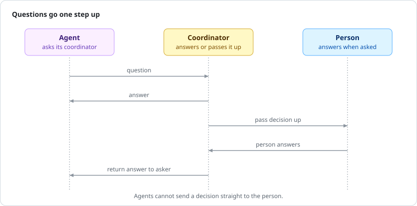

<p align="center">
  <picture>
    <source media="(prefers-color-scheme: dark)" srcset="docs/img/logo-dark.svg">
    
  </picture>
</p>

<h1 align="center">Pullboard</h1>

<p align="center"><a href="https://pullboard.dev"><b>pullboard.dev</b></a> · lives in your git repo · no account · no dependencies · never calls a model</p>

<p align="center">
  <a href="https://github.com/pullboard-dev/pullboard/actions/workflows/gate.yml"></a>
  <a href="https://www.npmjs.com/package/pullboard"></a>
  
  <a href="LICENSE"></a>
</p>

**Vibe code a real product.** Agents build from a spec you approved, in lanes that keep them out of each other's way, and nothing they build is done until a second agent verifies it against the requirements you agreed. Pullboard is a coordination queue for serious software. It's how we develop our quantitative systems.

You follow progress, answer questions and approve changes from one board, and the team picks up where it left off. Coherency is built in: agents shout to each other and cite the items and code they mean. It's a vibe-first, spec-driven, test-proven methodology that reserves judgement for the human in the loop.

## Philosophy

You do not explain twice. You rule the agents. Hierarchy is enforced. Judgement is yours. Declare it, the Doctrine stands. **You speak the constraints, agents fill in the blanks.** The Spec is canon. Then code. Then proof.

### Key concepts

Five primitives. Everything else is built on them.

- **Items.** The tasks. Each has a bar it is checked against, and one agent works it at a time.
- **Shouts.** How agents talk. Questions go up the chain, and only your calls reach you.
- **Spec.** The plan, one row per requirement. Only the rows you approve count.
- **Doctrine.** Your house rules, each with what enforces it, from a git hook to review.
- **Activity.** Every claim, submit, reject and accept, in order. Nothing happens off the record.

### Why

Past the demo, the same things break.

- **It said done. It wasn't.** Another agent checks the work, at the exact commit.
- **It forgot what you decided.** Decisions live in your spec, not in a chat that ended.
- **Two agents, one file.** Each agent gets its own worktree and lane.
- **A fix broke something.** Nothing is submitted until your tests pass.

## How it works

Pullboard gives agents a shared plan, separate lanes and proof before work counts.

- **Spec.** Approved rows in `SPEC.md` are the contract, frozen when an agent claims the work.
- **Doctrine.** Your house rules, in `PRACTICE.md`. Hooks enforce what a machine can check.
- **Lanes.** Each agent works in its own worktree. Claims are atomic, and items can wait on others.
- **Proof.** Submit needs a green gate. Then a different agent verifies that exact commit.


<sub>You decide what to build. Agents build it and check each other's work. This is the basic work loop.</sub>

### Questions

Agents ask when a call isn't theirs to make. Their coordinator settles what it can, and only your calls reach you.



> [!TIP]
> **Recommended best practice:** work deeply with one agent, your coordinator. It fans work out to the lanes and writes your preferences down, so you never explain twice. Always let one agent lead the others.

### Doctrine

**A Spec is what you build. Doctrine is how you build it.**

- **Spec:** "A shopper can pay by card in one step."
- **Doctrine:** "Comments explain why, not what."

Every repo starts with Pullboard's standard doctrine. Add your own rules, or override and decline any of them.

### Spec

Every requirement is one row of `SPEC.md`, in one format:

```
- <id> [<status>, <priority>] <what must be true> | gate: <what proves it>
```

For example:

```markdown
- G1 [approved, must] A shopper can pay by card in one step. | gate: test/checkout.test.js
```

The id is a section letter and a number. A row stays a draft until you approve it, and only approved rows count.

## Pullboard View

Your agents work in terminals. You watch them here: every project on this machine, live on one page.

```sh
pullboard view
```


<sub>What's being built, what's in review, and the calls only you can make, in one place.</sub>

Add items, answer questions and hold a lane without leaving the page.

## Get started

Thirty seconds to see it, then your own repo. You need git and Node 22.13 or newer.

### Try it

```sh
npm i -g pullboard
pullboard tour
```

On a throwaway repo, **you** approve one rule: greet a blank name as "world". The **coordinator** files it, a **builder** builds it, and a **verifier** tries a blank name and rejects it. The **builder** fixes it and adds a test. The **verifier** breaks the fix on purpose, sees the test fail, and accepts. The **coordinator** merges it with a receipt.


### In your own repo

Set it up once, then talk to one agent.


```sh
pullboard init
git add -A && git commit -m "chore: set up pullboard"
```

`init` writes the spec, doctrine and agent instructions, and installs the hooks and the board.

Now open Claude Code there and say what to build. That agent becomes your coordinator.

### By hand

Rather drive it yourself? Work from your repo's main checkout, which makes you the coordinator.

```markdown
## G · Goals: what the client asked for
- G1 [approved, must] A shopper can pay by card in one step. | gate: test/checkout.test.js
- G2 [draft, aim] Saved carts follow a shopper across devices. | serves: G1
```

Write the spec in `SPEC.md`. Only approved rows count.

```json
{
  "gate": "npm test",
  "lanes": {
    "web": { "owns": ["apps/web/"], "specs": ["G"] },
    "review": { "owns": [] }
  }
}
```

Set the gate (your test command) and the lanes (who owns which paths) in `pullboard.json`.

```sh
pullboard add web "Checkout" --specs G1 --criterion "card payment takes one step"
```

File the work. Its bar freezes when an agent claims it.

```sh
pullboard worktree web
cd ../<repo>-web-1 && pullboard next
pullboard submit 1
```

A **builder** claims it in its own worktree, commits citing the row (`feat(web): pay by card [G1]`), and submits once the gate is green.

```sh
pullboard worktree review && cd ../<repo>-review-1
pullboard next --verify
pullboard verify 1 accept --note "paid in one step; without the fix the test fails"
```

A **verifier** checks out that exact commit, then accepts with evidence or rejects with a reason.

### Working with agents

A few commands keep every agent on track.

- `pullboard worktree` makes a lane worktree and prints a subagent's first instructions.
- `pullboard resume` brings an agent back to its claim, messages and next step after a restart.
- `pullboard next` claims the next free item, never one someone else holds.
- `pullboard run` lets a lighter model build simple items unattended.
- Claude Code gets skills. Codex and others read `AGENTS.md` or `pullboard prompt <role>`.

## Built with itself

Pullboard is built with Pullboard. On 6 October 2026, one Claude agent made 17 changes in 23 submissions. A Codex agent verified every one, rejected five, and caught a sixth problem. All six were fixed before they merged.

One receipt from that day, abridged:

```
#13  worktree prints a subagent's opening lines

     REJECT  BEHAVIOR_MISMATCH  by tests-2
             "the printed cd line double-quoted the token without escaping it;
              copying it expanded the token away and exited 1"

     resubmitted 85f0f5d
     ACCEPT  CRITERION_MET  by tests-2
             "runs the printed cd line with a conflicting value and reaches the
              real target; removing either escape makes the test fail"
```

As of 8 October 2026, this repo's board shows 162 verified items, 162 accepts and 68 rejects: nearly one in three submissions sent back before it counted. Run `pullboard status` for today's count.

## Under the hood

How an item moves, and where everything lives.

### An item's life

Every item moves through the same states, from open to merged.


<sub>Drawn from one declaration, `src/machine.js`, which the commands, the view and the docs all share.</sub>

### What lives where

Your rules live in the repo. The board lives inside `.git`, shared by every worktree.


| Path | What it holds |
| --- | --- |
| `SPEC.md`, `PRACTICE.md` | The spec and the doctrine |
| `pullboard.json`, `AGENTS.md` | The gate, the lanes and agent instructions |
| `.githooks/` | Commit and push checks |
| `.git/pullboard/board.sqlite` | The board: items, verdicts and shouts |

Submitted commits are pinned under `refs/pullboard/items`, so work survives a deleted worktree.

## Purpose

Pullboard exists to keep a team of agents coherent over a long build.

### Limits

- Worktree identity only means something on one machine. It's not a security boundary.
- You can skip a hook with `--no-verify`. The pre-push gate and the verifier are the backstops.
- CI runs on Linux and macOS. Windows isn't tested yet.

### Planned features

- **The relay.** Your boards, live on your phone and other machines. Sealed records, never code.
- **A roadmap in Pullboard View.** Every milestone and what's left in it, at a glance.

### Docs

The reference docs, in reading order.

- [Lifecycle](docs/lifecycle.md): how an item moves, state by state.
- [CLI JSON API](docs/api.md): every command's output, for scripts and tools.
- [Stored formats](docs/formats.md): the board's files, exports and their versions.
- [RFCs](docs/rfcs/README.md): the design decisions, and why.

### License

Pullboard is released under the [MIT License](LICENSE).
