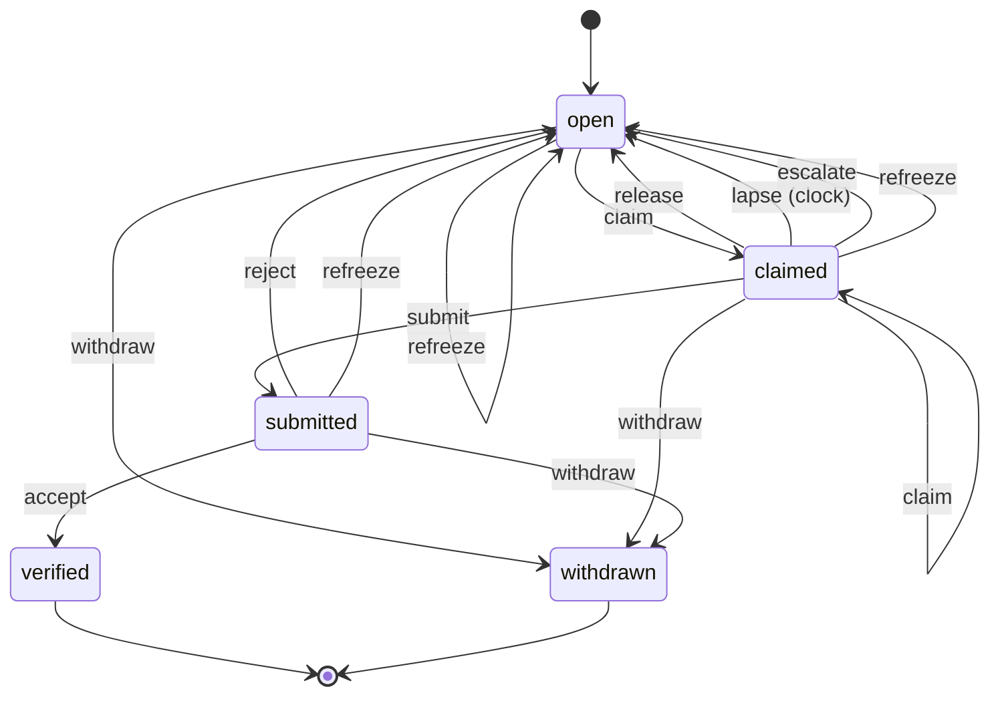

# The item lifecycle

Generated from src/machine.js by `pullboard lifecycle`. Do not edit it by hand: change the declaration, then run `pullboard lifecycle > docs/lifecycle.md`.

An item starts open. Its final states, verified and withdrawn, cannot be left, and every way into them passes the same exit guards, whatever command gets there. The board file itself refuses any move not declared here.

## States

| State | Means | Fields it needs |
| --- | --- | --- |
| open | waiting for a builder; claimable once what it waits on is verified | none |
| claimed | an agent holds it under a lease, its criterion frozen | item_owner, item_lease_until, item_frozen_digest |
| submitted | built and gated green at a pinned commit, waiting for another agent | item_built_by, item_commit, item_frozen_digest |
| verified (final) | another agent accepted it at the submitted commit | item_verified_by, item_commit |
| withdrawn (final) | nobody should build it; the reason stays on it | item_withdrawn_reason |

## Moves

Each move checks its guards in this order and refuses with the first one that does not hold.

| Move | From | To | Who | Guards, in order |
| --- | --- | --- | --- | --- |
| claim | open, claimed | claimed | agent, coordinator | joined (NOT_JOINED), itemExists (NO_ITEM), inState (NOT_CLAIMABLE), inLane (WRONG_LANE), routeAllows (ROUTE), dependenciesVerified (BLOCKED), notHeldByAnother (HELD), laneOpen (LANE_HELD), oneLiveClaim (ONE_CLAIM), rowsInForce (UNKNOWN_SPEC) |
| release | claimed | open | agent, coordinator | joined (NOT_JOINED), itemExists (NO_ITEM), inState (NOT_YOURS), isHolder (NOT_YOURS) |
| lapse | claimed | open | clock, when its lease runs out | none |
| submit | claimed | submitted | agent, coordinator | joined (NOT_JOINED), itemExists (NO_ITEM), inState (NOT_YOURS), isHolder (NOT_YOURS), criterionUnchanged (CRITERIA_CHANGED), treeClean (DIRTY), nothingUntracked (UNTRACKED), hasCommit (NO_COMMIT), gateConfigured (NO_GATE), gateGreen (GATE_RED), childrenDone (CHILDREN_OPEN), headIsNew (HEAD_NOT_NEW) |
| accept | submitted | verified | agent, coordinator | coordinatorSaysAs (MAIN_IS_COORDINATOR), joined (NOT_JOINED), itemExists (NO_ITEM), inState (NOT_SUBMITTED), atSubmittedCommit (NOT_AT_COMMIT), notBuilder (SELF_VERIFY), routeAllows (ROUTE), policyAllows (COORDINATOR_VERIFIES), criterionUnchanged (CRITERIA_CHANGED), reasonIsMet (BAD_REASON), proofNoted (PROOF_REQUIRED) |
| reject | submitted | open | agent, coordinator | coordinatorSaysAs (MAIN_IS_COORDINATOR), joined (NOT_JOINED), itemExists (NO_ITEM), inState (NOT_SUBMITTED), atSubmittedCommit (NOT_AT_COMMIT), notBuilder (SELF_VERIFY), routeAllows (ROUTE), policyAllows (COORDINATOR_VERIFIES), criterionUnchanged (CRITERIA_CHANGED), reasonCoded (BAD_REASON), noteGiven (NOTE_REQUIRED) |
| escalate | open, claimed | open | agent, coordinator | joined (NOT_JOINED), noteGiven (NOTE_REQUIRED), itemExists (NO_ITEM), holderOrCoordinator (NOT_YOURS), inState (CLOSED) |
| refreeze | open, claimed, submitted | open | coordinator | joined (NOT_JOINED), coordinatorOnly (COORDINATOR_ONLY), itemExists (NO_ITEM), inState (CLOSED), rowsInForce (UNKNOWN_SPEC) |
| withdraw | open, claimed, submitted | withdrawn | coordinator | joined (NOT_JOINED), coordinatorOnly (COORDINATOR_ONLY), noteGiven (NOTE_REQUIRED), itemExists (NO_ITEM), inState (CLOSED) |

## Exit guards

| Final state | Every move into it passes |
| --- | --- |
| verified | atSubmittedCommit, notBuilder, criterionUnchanged, proofNoted |
| withdrawn | coordinatorOnly, noteGiven |

## Refusals

| Code | Raised when this does not hold | Next step |
| --- | --- | --- |
| NOT_CLAIMABLE | claim: the item is in open, claimed | pullboard show <id> |
| NOT_YOURS | release: the item is in claimed | pullboard show <id> |
| NOT_YOURS | submit: the item is in claimed | pullboard show <id> |
| NOT_SUBMITTED | accept: the item is in submitted | pullboard show <id> |
| NOT_SUBMITTED | reject: the item is in submitted | pullboard show <id> |
| CLOSED | escalate: the item is in open, claimed | pullboard show <id> |
| CLOSED | refreeze: the item is in open, claimed, submitted | pullboard show <id> |
| CLOSED | withdraw: the item is in open, claimed, submitted | pullboard show <id> |
| NOT_JOINED | the caller is the main checkout, or a worktree that joined a lane | pullboard join <lane> (see: pullboard lanes) |
| NO_ITEM | the item exists | pullboard list --all |
| COORDINATOR_ONLY | the caller is the coordinator | run it from the main checkout |
| MAIN_IS_COORDINATOR | in the main checkout, the caller says it is the coordinator | verify from your own worktree; the coordinator adds --as coordinator |
| NOT_YOURS | the caller holds the item, or is the coordinator | shout its holder, or the coordinator |
| NOT_YOURS | the caller holds the claim | pullboard claim <id> |
| WRONG_LANE | the item is in the caller's lane; the main checkout builds coordinator-lane items only | cd <the lane's worktree> && pullboard claim <id> |
| ROUTE | the caller's route covers the item's: light, then mid, then strong | pullboard next, which offers only items your route covers |
| BLOCKED | every item it waits on is verified | claim another item, or shout the lane it waits on |
| HELD | no other agent holds it under a live lease | pullboard next |
| LANE_HELD | nobody holds its lane, unless the caller is renewing its own live claim | pullboard next --wait 9 (minutes) |
| ONE_CLAIM | the caller holds no other live top-level claim, reworks of its own rejected items aside | submit or release the other item first; child items are free |
| UNKNOWN_SPEC | every row the item cites exists and is in force, only where the criterion freezes: claiming an item with no frozen criterion, and refreeze | fix the spec, or the coordinator withdraws the item |
| CRITERIA_CHANGED | the criterion and the rows it cites read as they did at claim | the coordinator runs pullboard refreeze <id> |
| DIRTY | the worktree has no uncommitted changes | commit your changes, then submit |
| UNTRACKED | the worktree has no untracked files | commit or ignore them, then submit |
| NO_COMMIT | there is a commit to submit | commit your work, then submit |
| NO_GATE | the repo names a gate command | set "gate" in pullboard.json, e.g. "npm test" |
| GATE_RED | the gate is green at HEAD | fix what the digest names, commit, submit again |
| CHILDREN_OPEN | every child item is verified or withdrawn | finish the child items, or the coordinator withdraws them |
| HEAD_NOT_NEW | a verifier has not already rejected this commit | commit the rework, then submit |
| NOT_AT_COMMIT | the caller's checkout contains the submitted commit | git switch --detach <commit> |
| SELF_VERIFY | the caller did not build it | another agent verifies it: pullboard next --verify |
| COORDINATOR_VERIFIES | the repo's verify policy lets the caller verify this lane's work | the coordinator verifies it |
| BAD_REASON | an accept gives CRITERION_MET as its reason | a failed criterion is a reject: pullboard verify <id> reject --reason CODE |
| PROOF_REQUIRED | an accept notes how it was proved | --note "what you broke or which edge you tried, and what happened" |
| BAD_REASON | a reject names one of the reject reasons | --reason TEST_FAILURE, BEHAVIOR_MISMATCH, INSUFFICIENT_EVIDENCE, STALE_HEAD or OTHER |
| NOTE_REQUIRED | the move carries a note: what failed, what was tried, or why | --note "..." or --note-file <file> |
| BAD_DECISION | a verdict is accept or reject | pullboard verify <id> accept, or reject --reason CODE --note "..." |
