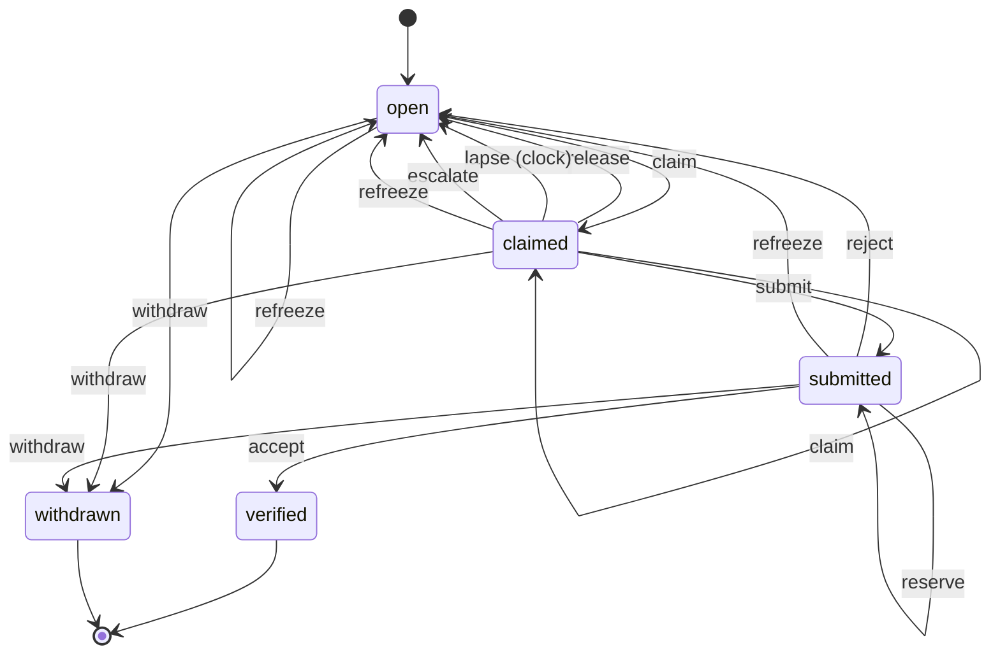

# The item lifecycle

Generated from src/machine.js by `pullboard lifecycle`. Do not edit it by hand: change the declaration, then run `pullboard lifecycle > docs/lifecycle.md`.

An item starts open. Its final states, verified and withdrawn, cannot be left, and every way into them passes the same exit guards, whatever command gets there. The board file itself refuses any move not declared here.

## Frozen check policy

The coordinator may set `check.install` and `check.timeout` in committed `pullboard.json`; the defaults are no install command and `5m`. Accept runs the configured install and the frozen item check in a private clone, under one timeout budget. It reuses the verifier’s npm cache when available. Install commands that need network downloads conflict with P2 (offline); configure an offline install or make its needed packages available in the cache.

Private commands drain their output through pipes, retaining a bounded 8 MiB capture of its beginning and end. Failed or unverifiable checks stream the complete log through secret scanning into an owner-readable artifact; lines over 64 KiB of UTF-8 data are replaced with a safe-scan marker. Output beyond the capture cap does not fail a successful command, and dependency files and build artifacts have no capture-size limit. A timeout kills the command's process group. An unverified check names how to restore the environment and retry; a failing check names rejection or builder rework as the next step.

## States

| State | Means | Fields it needs |
| --- | --- | --- |
| open | waiting for a builder; claimable once what it waits on is verified | none |
| claimed | an agent holds it under a lease, its criterion frozen | item_owner, item_lease_until, item_frozen_digest |
| submitted | built and gated green at a pinned commit, waiting for another agent | item_built_by, item_commit, item_frozen_digest |
| verified (final) | another agent accepted it at the submitted commit | item_verified_by, item_commit |
| withdrawn (final) | nobody should build it; the reason stays on it | item_withdrawn_reason |

## Moves

Each move checks its guards in this order and refuses with the first one that does not hold.

| Move | From | To | Who | Guards, in order |
| --- | --- | --- | --- | --- |
| claim | open, claimed | claimed | agent, coordinator | joined (NOT_JOINED), itemExists (NO_ITEM), inState (NOT_CLAIMABLE), inLane (WRONG_LANE), routeAllows (ROUTE), dependenciesVerified (BLOCKED), notHeldByAnother (HELD), laneOpen (LANE_HELD), oneLiveClaim (ONE_CLAIM), rowsInForce (UNKNOWN_SPEC or A5_GRAMMAR_VERSION or NO_POLICY or BAD_CONFIG) |
| release | claimed | open | agent, coordinator | joined (NOT_JOINED), itemExists (NO_ITEM), inState (NOT_YOURS), isHolder (NOT_YOURS), reviewReleaseExplained (NOTE_REQUIRED) |
| lapse | claimed | open | clock, when its lease runs out | none |
| submit | claimed | submitted | agent, coordinator | joined (NOT_JOINED), itemExists (NO_ITEM), inState (NOT_YOURS), isHolder (NOT_YOURS), criterionUnchanged (CRITERIA_CHANGED), treeClean (DIRTY), nothingUntracked (UNTRACKED), hasCommit (NO_COMMIT), withinLane (OUTSIDE_LANE or NO_POLICY or BAD_CONFIG or GIT_GRAFTS), trunkMergeClean (MERGE_CONFLICT or MERGE_CHECK_FAILED or NO_POLICY or NO_TRUNK), gateConfigured (NO_GATE), gateGreen (GATE_RED or PIPEFAIL_UNAVAILABLE), treeStillDuringGate (MOVED_DURING_GATE), childrenDone (CHILDREN_OPEN), headIsNew (HEAD_NOT_NEW) |
| reserve | submitted | submitted | agent, coordinator | coordinatorSaysAs (MAIN_IS_COORDINATOR), joined (NOT_JOINED), roadmapReadable (MILESTONES_CORRUPT), itemExists (NO_ITEM), inState (NOT_SUBMITTED), reviewCooldownElapsed (REVIEW_COOLDOWN), notBuilder (SELF_VERIFY), routeAllows (ROUTE), policyAllows (COORDINATOR_VERIFIES), familyAllows (O2_FAMILY_MATCH), reviewFree (REVIEW_HELD) |
| accept | submitted | verified | agent, coordinator | coordinatorSaysAs (MAIN_IS_COORDINATOR), joined (NOT_JOINED), itemExists (NO_ITEM), inState (NOT_SUBMITTED), atSubmittedCommit (NOT_AT_COMMIT or OUTSIDE_LANE or NO_POLICY or BAD_CONFIG or GIT_GRAFTS), notBuilder (SELF_VERIFY), routeAllows (ROUTE), policyAllows (COORDINATOR_VERIFIES), familyAllows (O2_FAMILY_MATCH), reviewFree (REVIEW_HELD), criterionUnchanged (CRITERIA_CHANGED), reasonIsMet (BAD_REASON), trunkMergeClean (MERGE_CONFLICT or MERGE_CHECK_FAILED or NO_POLICY or NO_TRUNK), itemCheckGreen (CHECK_RED or CHECK_UNVERIFIED), proofNoted (PROOF_REQUIRED) |
| reject | submitted | open | agent, coordinator | coordinatorSaysAs (MAIN_IS_COORDINATOR), joined (NOT_JOINED), itemExists (NO_ITEM), inState (NOT_SUBMITTED), atSubmittedCommit (NOT_AT_COMMIT or OUTSIDE_LANE or NO_POLICY or BAD_CONFIG or GIT_GRAFTS), notBuilder (SELF_VERIFY), routeAllows (ROUTE), policyAllows (COORDINATOR_VERIFIES), familyAllows (O2_FAMILY_MATCH), reviewFree (REVIEW_HELD), criterionUnchanged (CRITERIA_CHANGED), reasonCoded (BAD_REASON), noteGiven (NOTE_REQUIRED) |
| escalate | open, claimed | open | agent, coordinator | joined (NOT_JOINED), noteGiven (NOTE_REQUIRED), itemExists (NO_ITEM), holderOrCoordinator (NOT_YOURS), inState (CLOSED) |
| refreeze | open, claimed, submitted | open | coordinator | joined (NOT_JOINED), coordinatorOnly (COORDINATOR_ONLY), itemExists (NO_ITEM), inState (CLOSED), rowsInForce (UNKNOWN_SPEC or A5_GRAMMAR_VERSION or NO_POLICY or BAD_CONFIG) |
| withdraw | open, claimed, submitted | withdrawn | coordinator | joined (NOT_JOINED), coordinatorOnly (COORDINATOR_ONLY), noteGiven (NOTE_REQUIRED), itemExists (NO_ITEM), inState (CLOSED) |

## Exit guards

| Final state | Every move into it passes |
| --- | --- |
| verified | atSubmittedCommit, notBuilder, criterionUnchanged, proofNoted |
| withdrawn | coordinatorOnly, noteGiven |

## Refusals

| Code | Raised when this does not hold | Next step |
| --- | --- | --- |
| NOT_CLAIMABLE | claim: the item is in open, claimed | pullboard show <id> |
| NOT_YOURS | release: the item is in claimed | pullboard show <id> |
| NOT_YOURS | submit: the item is in claimed | pullboard show <id> |
| NOT_SUBMITTED | reserve: the item is in submitted | pullboard show <id> |
| NOT_SUBMITTED | accept: the item is in submitted | pullboard show <id> |
| NOT_SUBMITTED | reject: the item is in submitted | pullboard show <id> |
| CLOSED | escalate: the item is in open, claimed | pullboard show <id> |
| CLOSED | refreeze: the item is in open, claimed, submitted | pullboard show <id> |
| CLOSED | withdraw: the item is in open, claimed, submitted | pullboard show <id> |
| NOT_JOINED | the caller is the main checkout, or a worktree that joined a lane | pullboard join <lane> (see: pullboard lanes) |
| NO_ITEM | the item exists | pullboard list --all |
| COORDINATOR_ONLY | the caller is the coordinator | run it from the main checkout |
| MILESTONES_CORRUPT | the roadmap is readable when selecting the next review, only next --verify selection; a review reserved by id does not consult the roadmap | restore board metadata from a known-good board export |
| MAIN_IS_COORDINATOR | in the main checkout, the caller says it is the coordinator | verify from your own worktree; the coordinator adds --as coordinator |
| NOT_YOURS | the caller holds the item, or is the coordinator | shout its holder, or the coordinator |
| NOT_YOURS | the caller holds the claim | pullboard claim <id> |
| WRONG_LANE | the item is in the caller's lane; the main checkout builds coordinator-lane items only | cd <the lane's worktree> && pullboard claim <id> |
| ROUTE | the caller's route covers the item's: light, then mid, then strong | pullboard next, which offers only items your route covers |
| BLOCKED | every item it waits on is verified | claim another item, or shout the lane it waits on |
| HELD | no other agent holds it under a live lease | pullboard next |
| LANE_HELD | nobody holds its lane, unless the caller is renewing its own live claim | pullboard next --wait 9 (minutes) |
| ONE_CLAIM | the caller holds no other live top-level claim, reworks of its own rejected items aside | submit or release the other item first; child items are free |
| UNKNOWN_SPEC | every row the item cites exists and is in force, only where the criterion freezes: claiming an item with no frozen criterion, and refreeze | fix the spec, or the coordinator withdraws the item |
| A5_GRAMMAR_VERSION | every row the item cites exists and is in force, only where the criterion freezes: claiming an item with no frozen criterion, and refreeze | upgrade Pullboard or use a file written for grammar 1 |
| NO_POLICY | every row the item cites exists and is in force, only where the criterion freezes: claiming an item with no frozen criterion, and refreeze | restore the committed coordinator policy |
| BAD_CONFIG | every row the item cites exists and is in force, only where the criterion freezes: claiming an item with no frozen criterion, and refreeze | repair and commit the coordinator configuration |
| CRITERIA_CHANGED | the criterion and the rows it cites read as they did at claim | the coordinator runs pullboard refreeze <id> |
| DIRTY | the worktree has no uncommitted changes | commit your changes, then submit |
| UNTRACKED | the worktree has no untracked files | commit or ignore them, then submit |
| NO_COMMIT | there is a commit to submit | commit your work, then submit |
| NO_GATE | the repo names a gate command | set "gate" in pullboard.json, e.g. "npm test" |
| OUTSIDE_LANE | the full claimed diff respects committed coordinator ownership | restore foreign paths or shout their owner |
| NO_POLICY | the full claimed diff respects committed coordinator ownership | restore the claim base or ask the coordinator to refreeze |
| BAD_CONFIG | the full claimed diff respects committed coordinator ownership | restore the committed coordinator configuration |
| GIT_GRAFTS | the full claimed diff respects committed coordinator ownership | ask the coordinator to remove the Git graft file before retrying |
| MERGE_CONFLICT | the candidate merges cleanly into the current primary branch without changing an index or worktree | merge the trunk into your branch, resolve conflicts, commit and resubmit |
| MERGE_CHECK_FAILED | the candidate merges cleanly into the current primary branch without changing an index or worktree | use Git 2.38 or newer, restore its objects and retry |
| NO_POLICY | the candidate merges cleanly into the current primary branch without changing an index or worktree | restore the primary repository metadata |
| NO_TRUNK | the candidate merges cleanly into the current primary branch without changing an index or worktree | check out the trunk branch in the main checkout once and run pullboard inbox |
| CHECK_RED | the frozen item check passes at the exact submitted commit | reject the failing behavior; the builder fixes and resubmits |
| CHECK_UNVERIFIED | the frozen item check passes at the exact submitted commit | restore the frozen install or check environment and retry |
| GATE_RED | the gate, which submit runs itself every time, is green at HEAD | fix what the digest names, commit, submit again |
| PIPEFAIL_UNAVAILABLE | the gate, which submit runs itself every time, is green at HEAD | rewrite the gate without a pipe |
| MOVED_DURING_GATE | when the gate ends, HEAD and every tracked file are as they were when it started | leave the worktree alone until the gate finishes, then submit again |
| CHILDREN_OPEN | every child item is verified or withdrawn | finish the child items, or the coordinator withdraws them |
| HEAD_NOT_NEW | a verifier has not already rejected this commit | commit the rework, then submit |
| NOT_AT_COMMIT | the caller's checkout contains the submitted commit | git switch --detach <commit> |
| OUTSIDE_LANE | the caller's checkout contains the submitted commit | restore foreign paths before accepting |
| NO_POLICY | the caller's checkout contains the submitted commit | restore the frozen policy objects |
| BAD_CONFIG | the caller's checkout contains the submitted commit | repair the committed coordinator configuration |
| GIT_GRAFTS | the caller's checkout contains the submitted commit | ask the coordinator to remove the Git graft file before retrying |
| SELF_VERIFY | the caller did not build it | another agent verifies it: pullboard next --verify |
| COORDINATOR_VERIFIES | the repo's verify policy lets the caller verify this lane's work | the coordinator verifies it |
| O2_FAMILY_MATCH | the builder and verifier have different declared families; an undeclared family counts as a match, only when verify.family is require | ask the coordinator for a verifier from another declared family |
| REVIEW_HELD | no other agent holds its review under a live lease | pullboard next --verify, which passes over reviews another agent holds |
| BAD_REASON | an accept gives CRITERION_MET as its reason | a failed criterion is a reject: pullboard verify <id> reject --reason CODE |
| PROOF_REQUIRED | an accept notes how it was proved | --note "what you broke or which edge you tried, and what happened" |
| BAD_REASON | a reject names one of the reject reasons | --reason TEST_FAILURE, BEHAVIOR_MISMATCH, INSUFFICIENT_EVIDENCE, STALE_HEAD or OTHER |
| NOTE_REQUIRED | a review release gives a nonempty one-line reason, engine 5 or newer, only when freeing a submitted review reservation | release with --note "why", or --note-file <file> |
| REVIEW_COOLDOWN | the reviewer has not released this submission within the past hour, engine 5 or newer, only for the same reviewer and current submission | let another reviewer take it, or wait an hour or for a new submission |
| NOTE_REQUIRED | the move carries a note: what failed, what was tried, or why | --note "..." or --note-file <file> |
| BAD_DECISION | a verdict is accept or reject | pullboard verify <id> accept, or reject --reason CODE --note "..." |

For check diagnostics, a refusal from a failed or unverifiable check includes an output digest, sanitized tail, and a private full-output path in the CLI message (also `error.message` in JSON). The artifact is owner-readable only. If it cannot be saved, the tail remains available and the message names the storage error instead of claiming a path.
